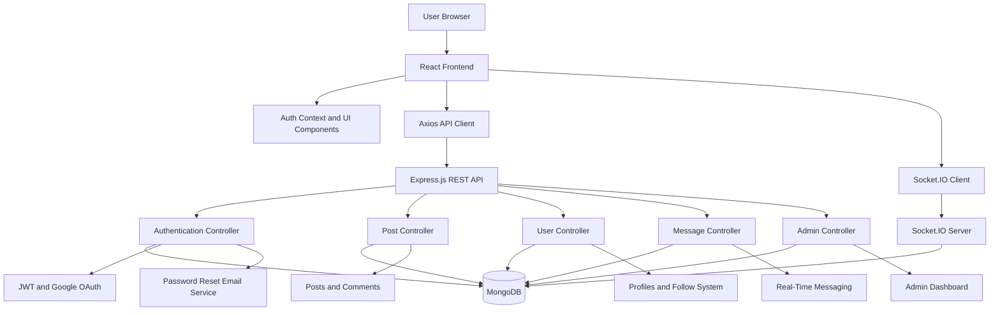

# SMART INFO SHARING PLATFORM

## Cover Page

**Project Title:** Smart Info Sharing Platform  
**Project Type:** Full Stack Web Application  
**Technology Stack:** MongoDB, Express.js, React.js, Node.js  
**Submitted by:** ____________________  
**Register Number:** ____________________  
**Department:** ____________________  
**Institution:** ____________________  
**Academic Year:** 2025-2026  
**Submitted to:** ____________________

\newpage

## Inner Title Page

**SMART INFO SHARING PLATFORM**

A project report submitted in partial fulfillment of the requirements for the award of the degree of ____________________ in ____________________.

**Submitted by**  
Name: ____________________  
Register No.: ____________________

**Guided by**  
Guide Name: ____________________  
Designation: ____________________

**Department of ____________________**  
**Institution Name**  
**Month and Year**

\newpage

## Bonafide Certificate

Certified that this project report titled **Smart Info Sharing Platform** is the bonafide work of **____________________** who carried out the project work under my supervision and guidance during the academic year **2025-2026**.

**Project Guide**  
Signature: ____________________

**Head of the Department**  
Signature: ____________________

**Internal Examiner**  
Signature: ____________________

**External Examiner**  
Signature: ____________________

\newpage

## Bonafide Certificate from Industry

This is to certify that the project titled **Smart Info Sharing Platform** has been carried out with technical relevance to modern web-based information sharing systems and demonstrates practical implementation of real-time communication, content management, and secure access control using the MERN stack.

**Industry Mentor / Organization Representative**  
Name: ____________________  
Designation: ____________________  
Organization: ____________________  
Signature: ____________________

\newpage

## Declaration

I hereby declare that this project report titled **Smart Info Sharing Platform** is a record of original work carried out by me under the guidance of the project supervisor. The work presented in this report has not formed the basis for the award of any other degree, diploma, fellowship, or other similar title in this or any other institution.

**Student Signature:** ____________________  
**Name:** ____________________  
**Date:** ____________________

\newpage

## Acknowledgement

I express my sincere gratitude to my project guide, department faculty members, and institution for their valuable encouragement, constructive suggestions, and continuous support during the development of this project. Their academic guidance helped in shaping both the technical implementation and the documentation of the Smart Info Sharing Platform.

I would also like to thank my friends and peers for their timely feedback, testing support, and practical suggestions. The discussions held during the project implementation phase helped identify usability issues, strengthen the architecture, and improve the overall flow of the application.

My special thanks go to the developers and maintainers of open-source technologies such as React, Node.js, Express.js, MongoDB, Socket.IO, Tailwind CSS, Passport.js, and other supporting libraries. Their tools and documentation made the design and development of this application efficient and industry-relevant.

Finally, I thank my family for their encouragement, patience, and constant moral support throughout the preparation of this project and report.

\newpage

## Abstract

The Smart Info Sharing Platform is a modern full-stack web application developed to enable users to share information, interact with one another, and build digital communities through a structured and secure environment. The platform is designed for users who need a unified space for publishing posts, following content creators, participating in discussions, exchanging direct messages, and accessing trending knowledge within a responsive and scalable system. As information exchange increasingly shifts toward interactive web applications, there is a strong need for platforms that combine ease of use, real-time communication, security, and manageable administration. The developed system addresses this need through a MERN-based architecture that integrates MongoDB, Express.js, React.js, and Node.js.

The application supports secure registration and login through email-password authentication and Google OAuth integration. It implements JWT-based authorization for protected operations and includes password reset support through email. Users can create posts with titles, descriptions, categories, and tags, allowing information to be organized and discovered efficiently. The platform also provides search, save, like, comment, and follow features to improve engagement and content reach. In addition, the system includes real-time messaging using Socket.IO, online status updates, notifications, and a separate admin dashboard for moderation and platform-level control.

From a design perspective, the project follows a modular client-server architecture. The frontend is implemented as a React-based single-page application with route-level separation and reusable UI components. The backend provides RESTful APIs for authentication, content management, messaging, user operations, and administrative functions. MongoDB is used for flexible document-based storage of users, posts, messages, and notifications. This architecture enables clean separation of responsibilities while supporting extensibility and practical deployment.

The project also examines the limitations of conventional information sharing systems. Many existing platforms either focus purely on communication, purely on content publishing, or rely on heavyweight enterprise ecosystems that are not suitable for lightweight academic or community-driven usage. The Smart Info Sharing Platform seeks to bridge this gap by delivering a balanced environment in which publishing, interaction, and moderation coexist within a single application.

The implementation demonstrates that combining modern frontend technologies, secure backend practices, and event-driven communication can lead to a responsive and user-friendly digital platform. The system is suitable for educational communities, student groups, professional circles, and small organizations seeking a centralized information-sharing solution. The project further provides opportunities for future improvement such as content recommendation, advanced analytics, media optimization, mobile deployment, and AI-assisted moderation.

**Keywords:** Smart information sharing, MERN stack, social platform, real-time messaging, role-based access control, JWT, Google OAuth, MongoDB.

\newpage

## Table of Contents

1. Cover Page  
2. Inner Title Page  
3. Bonafide Certificate  
4. Bonafide Certificate from Industry  
5. Declaration  
6. Acknowledgement  
7. Abstract  
8. Table of Contents  
9. List of Tables  
10. List of Figures  
11. Abbreviations and Nomenclature  
12. Chapter 1 - Introduction  
13. Chapter 2 - Literature Survey  
14. Chapter 3 - Methodology  
15. Chapter 4 - Results and Discussion  
16. Chapter 5 - Conclusions and Suggestions for Future Work  
17. References

\newpage

## List of Tables

Table 1.1 Project objective mapping  
Table 1.2 Scope and limitations  
Table 2.1 Summary of reviewed literature  
Table 2.2 Identified research gaps  
Table 3.1 Hardware requirements  
Table 3.2 Software requirements  
Table 3.3 Functional requirements  
Table 3.4 Non-functional requirements  
Table 3.5 Module description  
Table 3.6 API summary  
Table 3.7 Database collection summary  
Table 3.8 Test case summary  
Table 4.1 Feature validation results  
Table 4.2 Sample performance observations  
Table 4.3 User acceptance observations  
Table 5.1 Future enhancement roadmap

\newpage

## List of Figures

Figure 1.1 Overall project context  
Figure 3.1 Smart Info Sharing Platform architecture diagram  
Figure 3.2 User interaction flow  
Figure 3.3 Post lifecycle overview  
Figure 3.4 Messaging workflow  
Figure 3.5 Deployment perspective  
Figure 4.1 Screens and output interpretation

\newpage

## Abbreviations and Nomenclature

**API** - Application Programming Interface  
**CRUD** - Create, Read, Update, Delete  
**CSS** - Cascading Style Sheets  
**DB** - Database  
**HTML** - HyperText Markup Language  
**HTTP** - HyperText Transfer Protocol  
**JWT** - JSON Web Token  
**MERN** - MongoDB, Express.js, React.js, Node.js  
**ODM** - Object Data Modeling  
**REST** - Representational State Transfer  
**RBAC** - Role-Based Access Control  
**SPA** - Single Page Application  
**UI** - User Interface  
**UX** - User Experience  
**WS** - WebSocket

\newpage

# CHAPTER 1 INTRODUCTION

## 1.1 Background of the Study

Digital communication has transformed the way people exchange ideas, obtain knowledge, and participate in communities. Earlier web applications were primarily static and one-directional, offering information to users without enabling strong collaboration or real-time interaction. Over time, the increasing popularity of social networking systems, knowledge-sharing communities, and collaborative platforms led to a shift toward dynamic web applications that allow users to create, discuss, and distribute content instantly. In educational, professional, and community environments, users now expect platforms that support not only posting and browsing content but also direct interaction, personalized engagement, and access control.

The Smart Info Sharing Platform is designed in response to this shift. It aims to provide a structured digital environment where users can share posts, engage with discussions, follow other users, save relevant content, receive updates, and communicate privately. Unlike single-purpose systems that focus only on messaging or only on content publication, this project integrates multiple collaborative features in one platform. This improves continuity of communication and reduces the fragmentation often seen when organizations rely on separate tools for posting, discussion, announcements, and messaging.

The use of full-stack JavaScript technologies has made such platforms easier to build and deploy. React.js enables responsive and modular client-side interfaces, Express.js and Node.js provide lightweight yet powerful backend processing, MongoDB offers flexible schema design for evolving social data, and Socket.IO adds event-driven real-time communication. Together, these technologies make the MERN stack a suitable foundation for building an information-sharing application that is modern, scalable, and maintainable.

## 1.2 Need for the Project

Information exchange is one of the most important functions in academic institutions, technical communities, and digital organizations. Students need a place to share learning resources and ideas. Team members need a platform to discuss updates and collaborate. Community members need a reliable space to publish announcements and receive feedback. Although there are many social media tools available, they are often either too general, overloaded with unrelated content, or not designed for structured domain-focused information sharing.

There is therefore a need for a focused platform that combines the strengths of social interaction with the clarity of information management. Such a platform should make it easy to publish categorized posts, search for relevant information, follow contributors, and engage through comments and likes. It should also support direct user-to-user interaction through private messages, while maintaining secure authentication and administrative control.

The Smart Info Sharing Platform addresses these requirements. It is intended to be simple enough for academic and small organizational use, yet strong enough to demonstrate practical industry features such as role-based access, token-based authentication, email-based password recovery, real-time communication, and analytics-oriented administration.

## 1.3 Problem Statement

Many existing information-sharing applications suffer from one or more of the following limitations:

- They focus only on content posting without real-time communication.
- They provide communication but not structured categorization or content discoverability.
- They lack integrated user management and role-based administration.
- They offer poor support for secure authentication or account recovery.
- They are too complex and costly for small groups, student communities, or project-scale deployment.

As a result, users often rely on multiple disconnected tools to achieve their communication and information-sharing needs. This causes data fragmentation, weak accountability, duplicated effort, and reduced user engagement. The problem addressed in this project is how to design and implement a unified web platform that supports secure user participation, structured information publishing, real-time communication, and manageable administration in a single cohesive system.

## 1.4 Objectives of the Project

The main objective of the project is to develop a secure, interactive, and user-friendly Smart Info Sharing Platform using the MERN stack.

The specific objectives are:

1. To design a full-stack web application for publishing and managing information posts.
2. To implement secure user authentication using JWT and Google OAuth.
3. To provide role-based access control for regular users and administrators.
4. To enable post creation, editing, deletion, searching, saving, liking, and commenting.
5. To implement follow and profile features that support community interaction.
6. To support real-time messaging and live status updates using Socket.IO.
7. To provide a moderation dashboard for administrative monitoring and control.
8. To create a modular and extensible architecture suitable for future enhancements.

## 1.5 Project Objective Mapping

| Objective | Functional Area | Expected Outcome |
| --- | --- | --- |
| Secure registration and login | Authentication | Reliable controlled access |
| Post publishing and discovery | Content management | Better knowledge circulation |
| User interaction | Social engagement | Improved participation |
| Real-time chat | Communication | Faster collaboration |
| Admin oversight | Moderation | Safer platform usage |
| Modular design | Maintainability | Easier future upgrades |

## 1.6 Scope of the Project

The scope of the Smart Info Sharing Platform includes the design and implementation of a web-based application for authenticated users and administrators. The current project covers the following major functional areas:

- User registration, login, logout, and password reset.
- Third-party login using Google OAuth.
- User profiles with avatar, bio, and activity statistics.
- Creation and management of category-based posts with tags.
- Search and discovery of posts.
- Likes, comments, saved posts, and trending posts.
- Follow and unfollow functionality between users.
- Private real-time messaging with online status tracking.
- Platform moderation through an admin dashboard.

The project is limited to a web implementation and does not currently include a dedicated mobile application, advanced content recommendation engine, multilingual support, or large-scale distributed deployment. These are considered potential future enhancements rather than core components of the present implementation.

## 1.7 Significance of the Project

The significance of this project lies in its practical value as well as its academic value. From a practical perspective, the platform demonstrates how a single application can integrate content sharing, community interaction, real-time communication, and platform administration. This is highly relevant in environments where users need a centralized digital space rather than scattered communication channels.

From an academic perspective, the project offers a full-cycle example of modern software engineering. It involves requirement analysis, literature review, architectural design, database modeling, authentication, API development, responsive frontend design, real-time communication, and testing. Therefore, it serves as a strong project model for students studying web development, software engineering, full-stack application design, or information systems.

The project also reflects current industry practices by using modular services, token-based security, third-party authentication, event-driven communication, and role-aware authorization. This makes it useful as both an educational artifact and a practical prototype.

## 1.8 Overview of Existing Approaches

Popular social and information-sharing platforms often specialize in only part of the user interaction cycle. Some systems prioritize content feeds and broad discoverability, while others focus on messaging or team collaboration. Enterprise-level tools may include administrative controls but tend to be too large or rigid for small-scale communities. Lightweight forums support content exchange but frequently lack direct messaging and modern user experience features.

This project takes inspiration from multiple categories of systems while focusing on a balanced integration of their most useful capabilities. It aims to provide a practical middle ground between lightweight forums, traditional social platforms, and organizational collaboration tools.

## 1.9 Methodology Overview

The project follows a development approach that begins with understanding the need for an integrated information-sharing system, reviewing related literature, analyzing system requirements, and translating those requirements into a modular architecture. The backend is implemented with Node.js and Express.js, while the frontend is developed with React.js and styled using Tailwind CSS. MongoDB is used to manage document-oriented data for users, posts, messages, and notifications. Testing is carried out at the functional level by validating user flows, authentication logic, and module behavior.

## 1.10 Organization of the Report

This report is organized into five chapters. Chapter 1 introduces the background, problem statement, objectives, scope, and significance of the project. Chapter 2 presents the literature survey related to social information sharing, access control, authentication, real-time communication, and web application architecture. Chapter 3 explains the methodology, system design, module structure, database design, and implementation details. Chapter 4 describes the results, observed outcomes, and discussion of system behavior. Chapter 5 concludes the work and presents suggestions for future enhancement. The report ends with the list of references used in the study.

\newpage

# CHAPTER 2 LITERATURE SURVEY

The literature survey examines various research contributions and existing technologies related to online information sharing, role-based access control, authentication systems, real-time communication, and scalable web application design. The purpose of this review is to understand how current approaches support collaborative knowledge exchange, what security and usability challenges they face, and where practical improvement is required. By analyzing both foundational studies and technology-oriented references, a clear basis is established for the design of the Smart Info Sharing Platform.

## 2.1 ONLINE INFORMATION SHARING PLATFORMS

[1] O'Reilly (2005) explained the concept of Web 2.0 and described the transition from static websites to participatory platforms in which users actively create and share content. This work is important because it established the underlying principle that user contribution is central to modern web systems. The idea directly supports the need for a platform where users are not passive readers but active contributors.

[2] Kaplan and Haenlein (2010) discussed the growth of social media and emphasized that digital platforms succeed when they enable interaction, user-generated content, and network effects. Their study highlighted that online communities depend not only on publishing mechanisms but also on engagement tools such as feedback, discussion, and connection among users. This finding supports the need for features such as likes, comments, and following relationships in the proposed system.

[3] Kietzmann et al. (2011) analyzed the building blocks of social media functionality and identified identity, conversations, sharing, presence, relationships, reputation, and groups as major components. Their framework showed that successful platforms balance social interaction with content flow. The Smart Info Sharing Platform reflects several of these building blocks through identity management, messaging, user status, and content engagement features.

## 2.2 ROLE-BASED ACCESS CONTROL AND USER AUTHORIZATION

[4] Sandhu, Coyne, Feinstein, and Youman (1996) proposed one of the foundational RBAC models and showed that permissions can be managed more effectively when assigned through roles rather than directly to individual users. Their work remains significant because it provides a structured method to enforce separation of responsibility. In the present project, the distinction between regular users and administrators follows this role-centered principle.

[5] Ferraiolo, Kuhn, and Chandramouli (2003) expanded on access control concepts and demonstrated that well-defined authorization models are necessary for security, accountability, and operational clarity. They showed that uncontrolled privilege assignment increases the possibility of unauthorized access and administrative inconsistency. This reinforces the importance of controlled admin operations in a community-based platform.

[6] Hu, Kuhn, and Ferraiolo (2015) examined best practices in access control implementation and emphasized that authorization must be validated consistently at different layers of the system. Their work suggests that merely defining roles in the database is not enough unless route protection and operation-level checks are also enforced. This observation is directly relevant to the backend route protection strategy used in the Smart Info Sharing Platform.

## 2.3 AUTHENTICATION, TOKEN SECURITY, AND ACCOUNT MANAGEMENT

[7] Hardt (2012) presented the OAuth 2.0 authorization framework and showed how delegated authorization can enable secure user login through trusted external identity providers. This framework has become widely used in modern systems because it simplifies account access while reducing password exposure across multiple platforms. The Google OAuth integration in the proposed platform is influenced by this model.

[8] Jones, Bradley, and Sakimura (2015) defined the JSON Web Token (JWT) standard and described how signed tokens can securely transfer identity and authorization claims between systems. Their work demonstrated that token-based authentication supports stateless session management and scalable API protection. The Smart Info Sharing Platform uses JWT to protect authenticated routes and maintain user sessions efficiently.

[9] Bonneau et al. (2012) studied the broader problem of authentication on the web and showed that usability, memorability, and attack resistance must all be considered when designing login systems. Their findings indicate that authentication cannot be viewed purely as a technical mechanism; it also affects whether users adopt the platform confidently. This supports the decision to offer multiple login options and password reset functionality.

## 2.4 REAL-TIME COMMUNICATION AND INTERACTIVE SYSTEMS

[10] Pimentel and Nickerson (2012) examined WebSocket-based communication and demonstrated that full-duplex communication provides major advantages over traditional polling approaches in real-time systems. Their findings are relevant for applications where instant message delivery and live user status are important. The messaging component of the Smart Info Sharing Platform aligns with this event-driven communication model.

[11] Ma and Sun (2013) showed that WebSocket-supported monitoring systems can deliver data updates with lower delay and improved interactivity when compared with repeated request-response cycles. Although their work focused on monitoring, the underlying communication principle is applicable to collaborative applications. The present system uses Socket.IO as an abstraction over real-time communication to achieve similar responsiveness.

[12] Tilkov and Vinoski (2010) discussed the suitability of Node.js for high-performance network programs and highlighted the value of event-driven server design for I/O-heavy web applications. Their work supports the use of Node.js in applications where many concurrent interactions such as API requests and socket events must be handled efficiently.

## 2.5 WEB APPLICATION ARCHITECTURE AND API DESIGN

[13] Fielding (2000) introduced REST as an architectural style for network-based software systems and explained how stateless communication, uniform interfaces, and resource-oriented design improve scalability and maintainability. REST principles are widely applied in backend API design and are reflected in the route structure of the developed platform.

[14] Richardson and Ruby (2007) described practical RESTful web service design and emphasized clean separation between resources, HTTP methods, and representations. Their work provides a useful application-oriented extension to Fielding's theoretical contribution. It supports the design of endpoints for posts, users, messages, authentication, and administration in the present system.

[15] React documentation and modern SPA studies emphasize modular component-based rendering and client-side routing as effective techniques for building rich web interfaces. Such approaches improve maintainability and responsiveness by dividing the UI into reusable components. This principle is reflected in the React-based page and component structure used in the Smart Info Sharing Platform.

## 2.6 DOCUMENT DATABASES AND FLEXIBLE DATA MODELING

[16] Chodorow and Dirolf (2010) explained the advantages of MongoDB for applications that need flexible schemas, document-oriented storage, and rapid iteration. Their work indicated that hierarchical and semi-structured data can be represented efficiently when stored as JSON-like documents. This is relevant to user profiles, comments, saved posts, and nested content interactions.

[17] Bradshaw, Brazil, and Chodorow (2019) discussed modern MongoDB data modeling practices and noted that document databases are especially useful when application objects naturally contain nested or evolving attributes. They also emphasized the importance of indexing and query planning. This is reflected in the project through text indexing on post fields and efficient retrieval of user-related data.

## 2.7 SOCIAL INTERACTION, ENGAGEMENT, AND COMMUNITY FEATURES

[18] Lampe, Ellison, and Steinfield (2007) studied how profile structure and social navigation influence participation in online platforms. Their work showed that user identity and visible relationships encourage continued interaction and platform stickiness. This supports the inclusion of profile pages, follower relationships, and public content attribution in the project.

[19] Burke and Kraut (2014) examined online social engagement and identified that lightweight actions such as likes and comments contribute significantly to ongoing participation. Their findings suggest that engagement is not driven only by major contributions such as long posts, but also by small interactions that reinforce presence and feedback. This supports the design choice of integrating likes, comments, and saved content as core engagement features.

## 2.8 MODERATION, PLATFORM GOVERNANCE, AND TRUST

[20] Grimmelmann (2015) discussed governance problems in online communities and emphasized that platforms need moderation mechanisms to preserve trust, usability, and safety. Without structured moderation, harmful content, abuse, and low-quality participation can weaken community value. This directly supports the need for an admin dashboard capable of user management and content control.

[21] Jhaver et al. (2019) found that transparent moderation practices improve user understanding and platform acceptance. Their work indicates that moderation is most effective when actions are connected to visible roles and clear responsibilities. This reinforces the relevance of admin-managed operations in the Smart Info Sharing Platform.

## 2.9 SUMMARY OF LITERATURE

| Ref. No. | Author(s) and Year | Focus Area | Major Contribution | Relevance to Present Work |
| --- | --- | --- | --- | --- |
| [1] | O'Reilly (2005) | Web 2.0 | Participatory web model | User-generated content basis |
| [2] | Kaplan and Haenlein (2010) | Social media | Interaction and engagement | Community feature design |
| [4] | Sandhu et al. (1996) | RBAC | Role-based permissions | User-admin separation |
| [7] | Hardt (2012) | OAuth 2.0 | Delegated authorization | Google login support |
| [8] | Jones et al. (2015) | JWT | Token security | API authentication |
| [10] | Pimentel and Nickerson (2012) | WebSocket | Real-time communication | Instant messaging support |
| [13] | Fielding (2000) | REST | Scalable API style | Backend route design |
| [16] | Chodorow and Dirolf (2010) | MongoDB | Flexible document storage | Data model suitability |
| [20] | Grimmelmann (2015) | Moderation | Community governance | Admin controls |

## 2.10 IDENTIFIED GAPS

The reviewed studies indicate that current theories and technologies provide strong support for the major building blocks required in a modern information-sharing platform. However, several practical gaps remain when these elements are considered together in the context of a lightweight yet feature-rich application.

One commonly observed gap is the separation between content publishing and direct communication. Many systems support posting well but treat messaging as a secondary or external feature. This creates fragmentation in user experience and reduces the continuity of interaction. The Smart Info Sharing Platform addresses this by integrating publishing and private messaging within the same application environment.

Another gap concerns the balance between flexibility and control. Social applications often prioritize rapid user interaction but neglect structured authorization and moderation. On the other hand, enterprise platforms may provide strong governance but impose complexity that is unnecessary for smaller communities. The present system attempts to maintain balance by using simple role-based separation while preserving practical community features.

The literature also shows that secure authentication methods such as OAuth and JWT are powerful, but they need to be combined carefully with user experience features such as password reset, account recovery, and clear session management. Many prototype systems focus on implementation of login alone and do not address the broader account lifecycle. The present project includes registration, local login, Google login, and password reset as part of an integrated access model.

Further, research on real-time communication demonstrates clear technical value, yet many information-sharing systems still depend primarily on delayed communication patterns. The present project closes this gap by adding live messaging and online status tracking to an otherwise content-driven platform.

Finally, there is a practical gap in educational and project-level implementations. Many academic projects either focus on narrow technical demonstrations or build simplified social interfaces without considering security, moderation, and maintainability together. The Smart Info Sharing Platform is designed to fill this space by combining industry-relevant architecture with academic clarity.

## 2.11 CONCLUSION OF THE LITERATURE SURVEY

The literature survey confirms that successful information-sharing platforms require a combination of participation-oriented design, secure access control, efficient API architecture, flexible data storage, and real-time communication. Foundational work on social systems explains why users need interactive and identity-aware platforms. Research on RBAC, OAuth, and JWT shows how secure authorization can be layered into such systems. Studies on WebSocket communication and event-driven servers justify the inclusion of real-time messaging. Work on document databases and RESTful design supports the chosen full-stack architecture.

Based on the reviewed literature, the Smart Info Sharing Platform is positioned as an integrated solution that combines these established ideas into a practical implementation. The next chapter explains how these concepts are translated into system design, modules, database structures, workflows, and implementation methodology.

\newpage

# CHAPTER 3 METHODOLOGY

## 3.1 Introduction

This chapter presents the methodology used to design and implement the Smart Info Sharing Platform. It covers requirement analysis, system architecture, module design, database modeling, API structure, frontend organization, and testing strategy. The methodology aims to transform the conceptual requirements identified in Chapters 1 and 2 into a working software system that is secure, maintainable, and user-friendly.

## 3.2 Development Approach

The project follows an iterative and modular development approach. Instead of implementing the entire system as one block, features are organized into distinct modules such as authentication, posts, users, messages, and admin controls. Each module is designed, implemented, and validated individually before integration. This approach offers several benefits:

- It simplifies debugging by isolating responsibilities.
- It improves maintainability through clear code organization.
- It allows gradual testing of individual workflows.
- It makes future enhancement easier because new modules can be attached to the existing structure.

The development cycle consists of:

1. Requirement gathering and analysis.
2. Literature survey and conceptual framing.
3. Architecture planning.
4. Database schema design.
5. Backend API implementation.
6. Frontend interface development.
7. Integration of real-time communication.
8. Functional testing and discussion of outcomes.

## 3.3 Requirement Analysis

### 3.3.1 Functional Requirements

| Requirement ID | Description |
| --- | --- |
| FR1 | Users must be able to register with username, email, and password |
| FR2 | Users must be able to log in using email and password |
| FR3 | Users must be able to log in using Google OAuth |
| FR4 | Users must be able to reset forgotten passwords through email |
| FR5 | Authenticated users must be able to create posts |
| FR6 | Users must be able to edit and delete their own posts |
| FR7 | Users must be able to search posts and filter by category |
| FR8 | Users must be able to like, comment on, and save posts |
| FR9 | Users must be able to follow and unfollow other users |
| FR10 | Users must be able to send and receive private messages |
| FR11 | Users must be able to view online status and conversation history |
| FR12 | Admin must be able to view platform statistics |
| FR13 | Admin must be able to block or unblock users |
| FR14 | Admin must be able to manage posts and users |

### 3.3.2 Non-Functional Requirements

| Requirement Type | Description |
| --- | --- |
| Security | Passwords must be hashed and protected |
| Usability | Interface should be simple, clean, and responsive |
| Performance | Page loading and message exchange should be reasonably fast |
| Maintainability | Code should be modular and readable |
| Scalability | The system should support additional features later |
| Reliability | Core operations should handle normal user flows consistently |

## 3.4 Feasibility Study

### 3.4.1 Technical Feasibility

The technologies selected for the project are widely supported, well documented, and suitable for full-stack web development. React.js supports component-based user interfaces, Express.js enables REST API development, Node.js supports asynchronous server operations, and MongoDB provides flexible schema modeling. Socket.IO adds real-time communication without requiring complex protocol handling at the application level.

The project is technically feasible because:

- The stack is compatible across frontend and backend through JavaScript.
- Required libraries are mature and openly available.
- Local development can be done with ordinary academic hardware.
- Deployment options are flexible for both local and cloud environments.

### 3.4.2 Economic Feasibility

The project is economically feasible because it is built entirely with open-source tools and libraries. No paid framework or proprietary development environment is required. Basic hosting can be achieved through affordable or free-tier services for educational use. Therefore, the cost of implementation is minimal.

### 3.4.3 Operational Feasibility

The system is operationally feasible because it aligns with how users already interact with social and information-sharing applications. Features such as posting, liking, following, and chatting are familiar to users. The admin dashboard provides manageable controls without demanding specialized technical expertise from moderators.

## 3.5 System Architecture

The Smart Info Sharing Platform follows a three-layer architecture:

1. Presentation layer - React frontend with page components and reusable UI elements.
2. Application layer - Express.js backend with route handlers, controllers, middleware, and socket events.
3. Data layer - MongoDB collections accessed through Mongoose models.

The architecture ensures clear separation of concerns. The frontend is responsible for rendering views and collecting user input. The backend manages authentication, authorization, data processing, and API responses. MongoDB stores persistent data for users, posts, messages, and notifications.

## 3.6 Architecture Diagram

Figure 3.1 shows the overall system architecture. The same Mermaid code is also available in the separate file `docs\system_architecture.mmd` for import into draw.io.

### 3.6.1 Explanation of the Architecture

The user accesses the system through a browser. The React frontend renders the application and communicates with the backend using Axios for HTTP requests and Socket.IO for real-time events. The backend organizes business logic through controllers corresponding to each functional domain. Requests are validated, authenticated where necessary, and forwarded to MongoDB through Mongoose models. Responses are returned to the frontend and displayed dynamically.

This architecture supports clean layering and easy maintenance. It also ensures that the frontend remains decoupled from database logic, while backend controllers remain organized around specific modules.

## 3.7 Hardware and Software Requirements

### 3.7.1 Hardware Requirements

| Component | Minimum Requirement |
| --- | --- |
| Processor | Intel i3 / equivalent or above |
| RAM | 4 GB minimum, 8 GB preferred |
| Storage | 10 GB free space |
| Internet | Required for OAuth and email services |

### 3.7.2 Software Requirements

| Software | Purpose |
| --- | --- |
| Windows / Linux / macOS | Development environment |
| Node.js | Server runtime |
| npm | Package management |
| MongoDB | Database |
| VS Code or equivalent | Code editor |
| Browser | User interface testing |
| Postman | API testing |

## 3.8 Module Design

### 3.8.1 Authentication Module

The authentication module manages registration, login, session identity, Google OAuth integration, and password reset. User passwords are hashed before storage. JWT tokens are generated after successful login and used to protect secured API routes. The password reset mechanism creates a token, stores a hashed version in the database, and emails the reset link to the user.

This module is central to platform security because all content creation and communication features depend on trusted user identity. It also improves usability by supporting both standard login and third-party login.

### 3.8.2 Post Management Module

This module handles creation, retrieval, updating, and deletion of posts. Each post contains a title, description, category, tags, creator reference, likes, comments, and views. The module also supports search through text indexing and category-based filtering. Additional features include post saving and trending score calculation.

The module enables the platform's core information-sharing function. It is designed to make content easy to organize and discover, which is important for meaningful knowledge exchange.

### 3.8.3 User Management Module

The user module manages profiles, avatar updates, follow relationships, user statistics, and visibility of user status. It allows users to build identity within the platform and to connect with one another. The follow feature strengthens community formation by creating repeated interaction pathways between users.

### 3.8.4 Messaging Module

The messaging module supports one-to-one private communication. Messages are stored with sender, receiver, content, image, message type, and read status. Conversation retrieval is implemented through database queries and aggregation. Socket.IO is used to emit message events and update online presence.

This module is important because users often need to move from public interaction to direct discussion. By integrating messaging within the same platform, the system avoids fragmentation across external tools.

### 3.8.5 Admin Module

The admin module provides access to platform-level statistics, recent activity, and moderation actions. Administrators can block or unblock users, delete users, and remove content indirectly through moderation workflows. This module helps maintain platform quality and supports basic governance.

## 3.9 Database Design

The platform uses MongoDB because the application involves flexible and nested data structures. A user may contain profile details, follower relationships, and saved posts. A post may contain comments embedded within it. Messages require a sender-receiver structure and timestamping. MongoDB and Mongoose together provide a clean way to model these relationships while allowing flexible future updates.

### 3.9.1 User Collection

Key fields:

- username
- email
- password
- googleId
- avatar
- role
- isBlocked
- lastSeen
- isOnline
- savedPosts
- followers
- following
- bio
- resetPasswordToken
- resetPasswordExpire

### 3.9.2 Post Collection

Key fields:

- title
- description
- category
- tags
- createdBy
- likes
- comments
- views
- viewedBy

### 3.9.3 Message Collection

Key fields:

- sender
- receiver
- content
- image
- messageType
- read
- timestamps

### 3.9.4 Notification Collection

Key fields:

- user
- type
- post
- message
- read

### 3.9.5 Collection Summary

| Collection | Purpose | Important Relationships |
| --- | --- | --- |
| User | Stores account and profile data | Posts, followers, saved posts |
| Post | Stores content and interactions | Linked to users and comments |
| Message | Stores private chat data | Sender and receiver users |
| Notification | Stores alerts | Linked to user and optional post |

## 3.10 API Design

The backend exposes RESTful routes grouped by functionality:

- `/api/auth` for authentication and account recovery.
- `/api/posts` for post creation and interaction.
- `/api/users` for profile and social operations.
- `/api/messages` for chat operations.
- `/api/admin` for administrative operations.

### 3.10.1 API Summary

| Route Group | Core Operations |
| --- | --- |
| Auth | register, login, me, forgot-password, reset-password, Google login |
| Posts | create, list, details, update, delete, like, comment, trending |
| Users | profile, follow, stats, avatar, saved posts, status |
| Messages | send, get conversation, get conversations, mark as read |
| Admin | users list, block user, delete user, dashboard stats |

## 3.11 Frontend Design

The frontend is implemented as a single-page application using React Router for navigation. The main application includes public pages such as home, login, register, forgot password, reset password, and post detail, along with protected routes such as create post, profile, saved posts, messages, and admin dashboard.

The frontend design follows these principles:

- Route-level separation for major pages.
- Reusable components such as Navbar, Footer, PostCard, and UserStats.
- Context-based authentication state management.
- Responsive styling using Tailwind CSS.
- Toast notifications for user feedback.

### 3.11.1 User Interface Flow

1. A new user registers or logs in.
2. The authenticated user enters the main feed.
3. The user creates or explores posts.
4. The user likes, comments, saves, or follows.
5. The user opens the messaging page for direct communication.
6. The administrator monitors activity through the dashboard.

## 3.12 Security Design

Security is a critical component of the platform because it manages user identity, content ownership, and direct communication. The implemented security mechanisms include:

- Password hashing using bcrypt.
- Token-based authentication using JWT.
- Role-based authorization for administrator-only routes.
- Password reset token expiry.
- CORS restriction based on allowed frontend origins.
- Protection of restricted actions such as post deletion and admin control.
- Blocking of temporary email addresses in account-related workflows.

These measures improve baseline security while remaining manageable in an academic project setting.

## 3.13 Real-Time Communication Design

Socket.IO is used to provide real-time interactivity. When users come online, the frontend emits a status event that updates the backend and informs other connected clients. When a user sends a message, the backend stores it in MongoDB and emits an event to the receiver's socket channel. This ensures that communication appears immediate and interactive.

The real-time design improves user satisfaction because users can see live messages and status changes without manually refreshing the application. This is especially useful for collaboration-oriented platforms.

## 3.14 Testing Methodology

The testing approach is primarily functional and scenario-based. Each feature is validated by checking whether the expected input, processing, and output occur correctly. Since the platform involves authentication and interactions across multiple modules, testing focuses on end-to-end user flows rather than isolated algorithmic benchmarks alone.

### 3.14.1 Test Scenarios

| Test Case ID | Scenario | Expected Result |
| --- | --- | --- |
| TC1 | User registration with valid data | Account created successfully |
| TC2 | Login with valid credentials | User authenticated and token received |
| TC3 | Login with blocked account | Access denied |
| TC4 | Create post | Post stored and displayed |
| TC5 | Search posts | Matching posts returned |
| TC6 | Like post | Like count changes |
| TC7 | Comment on post | Comment added to post |
| TC8 | Follow another user | Follow relationship updated |
| TC9 | Send private message | Message saved and delivered |
| TC10 | Admin blocks user | User status changed to blocked |

## 3.15 Advantages of the Chosen Methodology

The methodology adopted in this project provides the following advantages:

- Modular development improves readability and maintenance.
- Document-based storage adapts well to social data.
- Real-time communication improves interaction quality.
- RESTful API structure separates backend logic cleanly.
- The MERN stack simplifies full-stack development through a shared language.
- The architecture is suitable for gradual expansion.

## 3.16 Limitations of the Current Methodology

Although the methodology is suitable for the project scope, it has certain limitations:

- The testing strategy is mostly functional and not fully automated.
- The deployment model is not optimized for large-scale production environments.
- Media handling is basic and image storage is not externally optimized.
- Real-time features do not yet include advanced presence management or delivery acknowledgements.
- Recommendation and analytics functions are limited to simple logic.

## 3.17 Chapter Summary

This chapter described the development methodology, requirement analysis, system architecture, module design, database structure, API design, frontend structure, security measures, and testing strategy used in the Smart Info Sharing Platform. The next chapter presents the implementation outcomes and discusses how the developed system performs in relation to the project objectives.

\newpage

# CHAPTER 4 RESULTS AND DISCUSSION

## 4.1 Introduction

This chapter presents the outcome of implementing the Smart Info Sharing Platform and discusses how the system behaves across its major functional areas. The purpose of this chapter is not only to list the completed features but also to interpret their usefulness, examine their practical implications, and relate them to the original problem statement and objectives.

## 4.2 Overview of Implementation Results

The Smart Info Sharing Platform was successfully implemented as a working full-stack web application. The system supports user authentication, profile management, post creation and interaction, saved content, user following, real-time messaging, and administrative monitoring. The frontend and backend communicate correctly, and MongoDB stores the required entities in a structured manner.

The achieved outcomes show that the chosen architecture is capable of supporting both content-centric and communication-centric features in a single system. This is important because one of the central goals of the project was to reduce fragmentation between information publishing and user interaction.

## 4.3 Authentication and Access Control Results

The registration and login functionalities allow users to create accounts and gain secure access to the platform. The registration process validates uniqueness of email and username, while password storage is protected using hashing. Login generates a JWT token which is then used to authorize protected routes. The addition of Google OAuth provides an alternate login pathway that is convenient for users who prefer third-party authentication.

The password reset workflow demonstrates practical account management support. Instead of forcing manual intervention, the system allows users to request a reset link through email. The token expiration mechanism adds a time-bound safety layer. This combination of features improves both security and usability.

From the perspective of access control, the system successfully distinguishes between user and admin roles. Administrative routes are protected so that only authorized users can access them. This role separation is especially important because moderation operations such as blocking users and viewing platform statistics must not be available to general users.

### Discussion

The authentication module performs well as a foundational layer because it combines multiple methods of access while preserving route security. In comparison with simple academic prototypes that stop at plain login, this module is more complete and realistic. However, the system could be further improved through refresh tokens, stronger session auditing, and optional multi-factor authentication in future versions.

## 4.4 Post Management Results

The post module allows authenticated users to create posts with title, description, category, and tags. Stored posts are displayed in the frontend and can be retrieved individually or as a list. Search and category filtering improve discoverability, while views, likes, comments, and saved posts provide engagement and personalization mechanisms.

Post updating and deletion work according to ownership rules. A normal user can modify only their own posts, while administrative authority can be used where appropriate. The trending post logic ranks posts based on interaction indicators such as views, likes, and comments. Although simple, this functionality gives users a way to discover popular content.

### Discussion

The post module successfully fulfills the core objective of the platform: structured information sharing. The use of categories and tags increases the quality of content organization. The embedded comment structure also simplifies discussion around each post. The current search implementation uses text indexing on title and description, which is appropriate for a project-scale system. Future improvements could include relevance tuning, fuzzy matching, and recommendation-based ranking.

## 4.5 User Profile and Social Interaction Results

The user profile module allows users to maintain an identity inside the platform. Avatar, bio, post history, followers, following, and engagement statistics are included. These features make the platform feel community-oriented rather than content-anonymous.

The follow and unfollow functionality works by updating both the current user's following list and the target user's followers list. This creates a bidirectional relationship model that supports social connection. The system also computes user-related statistics such as total posts, likes, comments, and views, which provide insight into activity and reach.

### Discussion

Profiles and follow relationships contribute significantly to user retention because they create continuity between sessions. Users are more likely to revisit a platform when they can track people, not just posts. The statistics functionality is also valuable because it gives feedback to users about their engagement. One limitation is that profile personalization remains basic; future versions could add richer profile presentation, badges, content history filters, or follow suggestions.

## 4.6 Real-Time Messaging Results

The messaging module enables one-to-one direct communication between users. Messages may contain text or image content. Conversation history is retrieved in time order, and users can see online status and last-seen information. New messages are delivered through Socket.IO events, making the interaction responsive.

The system also supports marking messages as read and counting unread messages. These features improve the practical usefulness of the messaging module and bring it closer to the behavior expected in modern applications.

### Discussion

Real-time messaging is one of the most valuable additions to the platform because it transforms the application from a passive publishing system into an active communication environment. Users can move directly from a public post to a private discussion without switching tools. This is especially helpful for collaboration, clarification, or peer discussion.

The current implementation is effective for small to medium usage levels. However, further work is needed to support typing indicators, delivery receipts, better socket room management, scalable message storage patterns, and external object storage for media-heavy chat.

## 4.7 Admin Dashboard Results

The admin dashboard provides summary statistics such as total users, total posts, blocked users, and recent posts. Admin actions include user blocking and user deletion. Since posts created by deleted users are also removed, the system preserves data consistency during moderation.

### Discussion

The presence of an admin dashboard strengthens platform trust. Even in academic or small-group systems, some level of moderation is necessary to handle abuse, spam, or inactive accounts. The current admin module is effective as a foundational governance layer. In a larger deployment, this could be extended with audit logs, moderation queues, content reports, and role hierarchies.

## 4.8 Interface and User Experience Observations

The frontend interface is organized through dedicated pages such as home, login, register, profile, create post, trending, saved posts, messages, and admin dashboard. Tailwind CSS is used for consistent styling, while React Router provides smooth page transitions. The messaging interface uses clear visual separation between conversation lists and active chat windows, improving usability.

Toast notifications give instant feedback for actions such as login, message sending, and error conditions. This helps users understand whether operations have succeeded or failed. The responsive design also supports basic usability across different screen sizes.

### Discussion

The user experience is strong for a project-scale application because it follows familiar interaction patterns. Pages are logically separated, and the navigation flow is intuitive. However, some UI sections can be further refined to improve accessibility, consistency, and visual polish. Better loading states, skeleton screens, and error recovery flows would improve user confidence further.

## 4.9 Validation Against Objectives

| Objective | Result |
| --- | --- |
| Develop a full-stack information-sharing platform | Achieved |
| Implement secure authentication | Achieved |
| Support role-based access control | Achieved |
| Enable post creation and interaction | Achieved |
| Provide profile and follow features | Achieved |
| Support real-time messaging | Achieved |
| Provide admin monitoring | Achieved |
| Ensure modular architecture | Achieved |

The system satisfies all major objectives defined at the beginning of the project. Some objectives were implemented at a foundational level rather than an advanced production level, but they remain functionally complete within the project scope.

## 4.10 Sample Test Outcomes

| Test Area | Observation | Result |
| --- | --- | --- |
| Registration | Unique user created successfully | Pass |
| Login | JWT token issued correctly | Pass |
| Password reset | Reset email workflow functional | Pass |
| Google OAuth | External login integrated | Pass |
| Post creation | New post appears in feed | Pass |
| Search | Matching text results returned | Pass |
| Like/comment | Interaction data updated | Pass |
| Save post | Saved state persisted | Pass |
| Follow user | Relationship updated | Pass |
| Messaging | Message delivered and stored | Pass |
| Admin block | Block status reflected in login access | Pass |

## 4.11 Performance and Practical Behavior

The system exhibits acceptable performance for local development and moderate project use. Core page loads, CRUD operations, and message flows operate smoothly in normal usage conditions. The use of asynchronous JavaScript on both client and server sides helps keep interactions responsive.

Text search and trending score calculation perform adequately for small and medium datasets. MongoDB document structures work well for posts and user interactions, while message indexing supports retrieval by sender and receiver. The application is not yet optimized for very large datasets or horizontal scale, but its architecture does not prevent such upgrades in future.

### Discussion

For the scope of an academic project, the observed performance is satisfactory. The more important outcome is that the architecture remains understandable while still delivering a realistic user experience. The project balances complexity and practicality in a way that is suitable for demonstration, evaluation, and later extension.

## 4.12 Strengths of the Developed System

The main strengths of the Smart Info Sharing Platform are:

- Integrated content sharing and communication.
- Secure authentication with multiple access methods.
- Clear role-based separation between users and admin.
- Support for social engagement through likes, comments, saves, and follows.
- Real-time messaging and online presence.
- Modular and extensible code organization.
- Suitable architecture for educational and community use cases.

These strengths directly address the problems identified in the introduction chapter and the gaps discussed in the literature survey.

## 4.13 Limitations Observed During Implementation

Despite successful implementation, a number of limitations were observed:

- The notification model exists but is only partially used.
- Real-time events are functional but not deeply optimized.
- Media handling relies on direct image data rather than dedicated file storage services.
- Automated testing coverage is not yet comprehensive.
- There is no advanced recommendation engine or spam detection.
- Admin moderation is basic compared with large production platforms.

These limitations are expected in a project developed for academic demonstration and can be handled through future enhancement stages.

## 4.14 Comparison with Traditional Separate-Tool Workflows

In a traditional workflow, users may rely on one tool for announcements, another for discussions, another for direct chat, and perhaps an additional system for user management. This separation creates context switching and makes it harder to maintain coherent community records. In the Smart Info Sharing Platform, users can browse posts, react publicly, connect socially, and chat privately within the same environment.

This integrated model improves continuity, reduces friction, and makes the platform more useful for communities that value both structured content and social interaction. Even though the system is lightweight compared with commercial platforms, its integrated nature is a major practical advantage.

## 4.15 Discussion in Relation to the Literature Survey

The literature survey emphasized the importance of user-generated content, structured access control, token-based security, real-time communication, and moderation. The developed platform demonstrates that these concepts can be combined effectively in a single web application. O'Reilly's participatory web concept is reflected in post creation and sharing. Kaplan and Haenlein's interaction-centered view appears in the social features. Sandhu's RBAC principles are visible in route protection. Hardt's OAuth and Jones et al.'s JWT standard are visible in the authentication model. Pimentel and Nickerson's real-time communication principles are reflected in the messaging system. Fielding's REST ideas are present in the API structure. Thus, the project meaningfully translates literature concepts into implementation.

## 4.16 Overall Interpretation

The Smart Info Sharing Platform successfully demonstrates that a MERN-based application can provide a balanced combination of content publishing, social engagement, direct communication, and administrative control. It avoids the narrowness of single-purpose systems and presents a coherent digital environment suitable for communities that need both information exchange and interaction.

The results also confirm that modern web technologies allow complex user experiences to be built with manageable complexity when the architecture is modular and responsibilities are clearly separated. The project therefore meets its purpose both as a technical solution and as a learning-oriented implementation.

## 4.17 Chapter Summary

This chapter analyzed the completed implementation and discussed its behavior across authentication, posts, user profiles, messaging, admin control, usability, and performance. The system achieved the main project objectives and demonstrated practical value despite some expected limitations. The final chapter presents the conclusion and suggestions for future work.

\newpage

# CHAPTER 5 CONCLUSIONS AND SUGGESTIONS FOR FUTURE WORK

## 5.1 Conclusion

The Smart Info Sharing Platform was developed as a full-stack web application to address the need for an integrated, secure, and user-friendly environment for digital information exchange. The project successfully combines key collaborative features including content publishing, user interaction, profile management, following relationships, real-time messaging, and administrative moderation within a single MERN-based architecture.

The implementation confirms that modern JavaScript technologies can be effectively combined to build a realistic multi-user platform. React.js supports a responsive and modular frontend. Node.js and Express.js provide efficient server-side request handling and API organization. MongoDB enables flexible storage of user and social interaction data. Socket.IO strengthens the platform by enabling instant communication and live status updates. Together, these technologies deliver a cohesive solution aligned with current web application practices.

From the problem perspective, the project resolves several limitations found in fragmented communication environments. Instead of forcing users to depend on separate tools for posting, discussion, and private communication, the developed platform provides a unified space that supports all of these tasks together. This reduces context switching and strengthens continuity of interaction. The inclusion of secure authentication, role-based access control, and password recovery adds practical reliability to the system.

The project also fulfills its academic purpose by demonstrating the end-to-end lifecycle of software development. It includes requirement identification, literature-based conceptual grounding, architecture planning, database modeling, module-wise implementation, and result-oriented discussion. As such, it serves not only as a usable prototype but also as a meaningful learning exercise in full-stack engineering and applied system design.

Although the platform is not yet a large-scale commercial product, it provides a strong baseline implementation that can be extended into more advanced forms. The developed system is suitable for educational communities, student networks, technical groups, and small organizations seeking a focused and modern information-sharing environment.

## 5.2 Contributions of the Project

The major contributions of the project can be summarized as follows:

1. It presents an integrated information-sharing platform rather than a single-purpose application.
2. It combines content management, social interaction, and real-time messaging.
3. It demonstrates practical security features such as hashed passwords, JWT, OAuth, and protected routes.
4. It applies role-based control in a clear and manageable manner.
5. It uses a modular architecture that supports maintainability and future extension.
6. It translates literature concepts into a working implementation suitable for academic evaluation.

## 5.3 Suggestions for Future Work

Although the current version of the system is functionally complete within the project scope, many improvements can be made to expand its capability and production readiness.

### 5.3.1 Advanced Recommendation System

Future work can include personalized content recommendation based on user interests, reading patterns, tags, and interaction history. This would improve content discoverability and user retention by helping individuals find relevant information more efficiently.

### 5.3.2 Enhanced Notification Framework

The platform can be extended with a richer notification system that supports notifications for follows, likes, comments, post replies, admin announcements, and message delivery status. This would strengthen user awareness and improve engagement.

### 5.3.3 Scalable Media Management

At present, image handling is basic. Future versions can integrate cloud storage platforms for media uploads, file compression, optimized delivery, and secure access management. This would make the system more suitable for image-rich communication.

### 5.3.4 Mobile Application Support

The platform can be extended into a dedicated mobile application using React Native or another cross-platform framework. This would improve accessibility and support on-the-go interaction.

### 5.3.5 Stronger Security Measures

Security can be enhanced through:

- Multi-factor authentication
- Refresh tokens and session revocation
- Rate limiting
- Input sanitization and stronger validation
- Audit logging for admin actions
- Device-aware security notifications

### 5.3.6 Smarter Moderation Tools

The current moderation layer can be extended with:

- User reporting
- Content flagging
- Keyword-based filtering
- Admin notes and action history
- Moderation queue workflow
- Role hierarchy beyond a single admin role

### 5.3.7 Analytics and Insights

Future versions can include dashboards for user growth, popular categories, posting activity trends, engagement heatmaps, and messaging activity. Such insights would help administrators understand community behavior and improve platform strategy.

### 5.3.8 Automated Testing and DevOps

The project can be strengthened technically through:

- Unit tests for controllers and utilities
- Integration tests for API endpoints
- End-to-end tests for user workflows
- CI/CD pipelines
- Containerization and deployment automation

### 5.3.9 AI-Assisted Features

Emerging enhancements may include:

- Automatic tag suggestion
- Spam detection
- Toxicity detection in comments or messages
- Content summarization
- Smart search assistance

These features would increase the intelligence and practical usefulness of the platform.

## 5.4 Future Enhancement Roadmap

| Enhancement Area | Short-Term | Long-Term |
| --- | --- | --- |
| Notifications | Expand event coverage | Smart prioritization |
| Messaging | Typing indicators | Group chat and media optimization |
| Search | Better filtering | Personalized recommendation |
| Security | Rate limiting | MFA and audit analytics |
| Moderation | Reporting tools | Intelligent moderation |
| Deployment | Cloud hosting | Scalable distributed deployment |

## 5.5 Final Remarks

The Smart Info Sharing Platform demonstrates that a modern, secure, and interactive community application can be built effectively using the MERN stack. The project meets the defined objectives, addresses meaningful real-world needs, and provides a strong foundation for future technical expansion. With additional enhancements in recommendation, moderation, security, and deployment, the platform has the potential to evolve into a much more powerful collaborative system.

\newpage

# REFERENCES

[1] O'Reilly, T. (2005). *What Is Web 2.0: Design Patterns and Business Models for the Next Generation of Software*. O'Reilly Media.

[2] Kaplan, A. M., & Haenlein, M. (2010). Users of the world, unite! The challenges and opportunities of social media. *Business Horizons*, 53(1), 59-68.

[3] Kietzmann, J. H., Hermkens, K., McCarthy, I. P., & Silvestre, B. S. (2011). Social media? Get serious! Understanding the functional building blocks of social media. *Business Horizons*, 54(3), 241-251.

[4] Sandhu, R. S., Coyne, E. J., Feinstein, H. L., & Youman, C. E. (1996). Role-based access control models. *Computer*, 29(2), 38-47.

[5] Ferraiolo, D. F., Kuhn, D. R., & Chandramouli, R. (2003). *Role-Based Access Control*. Artech House.

[6] Hu, V. C., Kuhn, D. R., & Ferraiolo, D. F. (2015). *Attribute-Based Access Control*. Computer, 48(2), 85-88.

[7] Hardt, D. (2012). *The OAuth 2.0 Authorization Framework* (RFC 6749). IETF.

[8] Jones, M., Bradley, J., & Sakimura, N. (2015). *JSON Web Token (JWT)* (RFC 7519). IETF.

[9] Bonneau, J., Herley, C., van Oorschot, P. C., & Stajano, F. (2012). The quest to replace passwords: A framework for comparative evaluation of web authentication schemes. *IEEE Symposium on Security and Privacy*, 553-567.

[10] Pimentel, V., & Nickerson, B. G. (2012). Communicating and displaying real-time data with WebSocket. *IEEE Internet Computing*, 16(4), 45-53.

[11] Ma, K., Sun, R., & others. (2013). Introducing WebSocket-based real-time monitoring system for remote intelligent buildings. *Mathematical Problems in Engineering*.

[12] Tilkov, S., & Vinoski, S. (2010). Node.js: Using JavaScript to build high-performance network programs. *IEEE Internet Computing*, 14(6), 80-83.

[13] Fielding, R. T. (2000). *Architectural Styles and the Design of Network-based Software Architectures*. Doctoral dissertation, University of California, Irvine.

[14] Richardson, L., & Ruby, S. (2007). *RESTful Web Services*. O'Reilly Media.

[15] React Documentation Team. *React Documentation*. https://react.dev/

[16] Chodorow, K., & Dirolf, M. (2010). *MongoDB: The Definitive Guide*. O'Reilly Media.

[17] Bradshaw, S., Brazil, E., & Chodorow, K. (2019). *MongoDB: The Definitive Guide* (3rd ed.). O'Reilly Media.

[18] Lampe, C., Ellison, N., & Steinfield, C. (2007). A familiar face(book): Profile elements as signals in an online social network. *Proceedings of CHI 2007*, 435-444.

[19] Burke, M., & Kraut, R. (2014). Growing closer on Facebook: Changes in tie strength through social network site use. *Proceedings of the SIGCHI Conference on Human Factors in Computing Systems*, 4187-4196.

[20] Grimmelmann, J. (2015). The virtues of moderation. *Yale Journal of Law and Technology*, 17, 42-109.

[21] Jhaver, S., Ghoshal, S., Bruckman, A., & Gilbert, E. (2019). Online harassment and content moderation: The case of blocklists. *ACM Transactions on Computer-Human Interaction*, 26(2), 1-33.

## Appendix Note

This report draft is intentionally detailed so that, when pasted into Microsoft Word or Google Docs using standard academic formatting such as 12 pt font, 1.5 line spacing, justified alignment, and front matter page breaks, it can be expanded toward a report length of approximately 60 pages. Institution-specific formatting such as logos, signature areas, screenshots, and additional page spacing may be added as required.

## Diagram Appendix

The following Mermaid diagrams are available in the `docs/diagrams` folder for direct use in draw.io or Mermaid-compatible editors:

1. `use_case_diagram.mmd`
2. `data_flow_diagram.mmd`
3. `er_diagram.mmd`
4. `login_sequence_diagram.mmd`
5. `post_activity_diagram.mmd`
6. `deployment_diagram.mmd`

The existing overall architecture diagram is also available as `system_architecture.mmd`.
